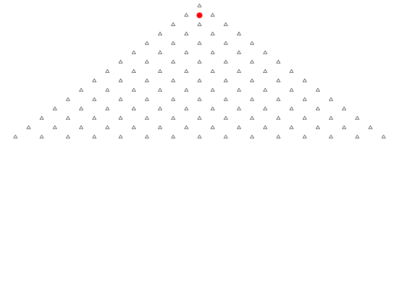

```{r setup, include=FALSE}
knitr::opts_chunk$set(echo = TRUE)
library(animation)
ani.options(interval = 0.05, nmax = 200 + 15 - 2)
set.seed(123)
```

##Question 1 (Median)

In the last homework assignment, you calculated the expectation and the variance of the Beta distribution with parameters a=6 and b=2. This time around, find the median. Give a numerical solution without using pbeta and check graphically if your solution makes sense. Tip: Use uniroot in R.

I am going to plot the CFD of the beta distribution.

```{r, echo=T}
alpha = 6
beta = 2

secuencia = seq(0, 1, by = 0.001)

plot(secuencia, pbeta(secuencia, 2,6), xlab="X",
     ylab = "Beta CDF", type = "l", col = "blue")


```
The median of the beta distribution is a real number that F(X < m) = 0.5 and F(X > m) = 0.5, so I will add some lines for see where the median should be.

```{r, echo=FALSE}

plot(secuencia, pbeta(secuencia, 2,6), xlab="X",
     ylab = "Beta CDF", type = "l", col = "blue")
abline(h = 0.5, lty = 9, v = 0.2255)

```
Now I want to get that point in the function, but my function is behind 0 so I will subtract 0.5
so that I can get root.

```{r,echo=FALSE}

plot(secuencia, pbeta(secuencia, 2,6) - 0.5, xlab="X",
     ylab = "Beta CDF", type = "l", col = "blue")
abline(h = 0, lty = 9)
points(x=1, y = 0.5)
points(x=0, y = -0.5)
points(x=1, y = 0)
points(x=0, y = 0)
segments(1, 0.5, 1,0)
segments(0, -0.5, 0,0)
points(x=0.5, y = 0)

```
Next I will use bisection method for getting the roots of my function.


```{r, echo=FALSE}
plot(secuencia, pbeta(secuencia, 2,6) - 0.5, xlab="X",
     ylab = "Beta CDF", type = "l", col = "blue")
abline(h = 0, lty = 9)
points(x=0, y = -0.5)
points(x=0, y = 0)
segments(0, -0.5, 0,0)
points(x=0.5, y = 0)
points(x=0.5, y = 0.437)
segments(0.5, 0, 0.5,0.437)
points(0.25,0)
```
If I continue like this I will reach the root therefore my solution.

But we cannot use pbeta so I will create my own method that will integrate the beta distribution for the given x so that I am not using pbeta


First I am going to create a function that integrates the beta function for a given X.

```{r}

BetaDistribution <- function(x, alpha, beta){
  return (1 - integrate(dbeta, lower=0, upper=x, alpha, beta)$value)
}

```

Now I am going to use a bisection method for geting the root
```{r}

median <- function(alpha, beta) {
  return(uniroot(function(x) BetaDistribution(x,alpha,beta) - 0.5, lower = 0, upper = 1)$root)
}

median(alpha, beta)

```

I saw an aproximation for the median that is:

```{r}

aproximation <- function(alpha,beta){
    return ((alpha - 1/3) / (alpha + beta-2/3))
}

aproximation(alpha, beta)
```
Now I will calculate the error of the aproximation
```{r}


sqrt((aproximation(alpha, beta) - median(alpha, beta))^2) 
```

##Question 2

Answer the question in topic 8 on slide 14: Can you use the central limit theorem to explain why the histogram
produced should look approximately Normal? Give a mathematical explanation and provide the parameters
of the Normal distribution.

Can you use the central limit theorem to explain why the histogram produced should
look approximately Normal?


When one ball reach the triangle, we can see that the ball has two possibilities, either go to the left or go to the right. So the ball has to take one direction (D), and the probability of taking one direction or the other is a Bernoulli trial.

$$ 
D=\left\{ \begin{array}{ll} 0 & \text{if }x = \text{Left } \\  
1 & \text{if }x = \text{Rigth }
\end{array}
\right. ,  D ∼ Bernoulli(P = 0.5)
$$


```{r}

t <- seq(0, 2 * 3.1416, length.out = 100)
a <- 0 
b <- 1 
radio <- 0.5
x <- a + cos(t)*radio
y <- b + sin(t)*radio

plot(0, 0, asp = 1, type = "n", xlim = c(-2, 2), ylim = c(-2, 2), xaxt = "n", yaxt = "n")
title("Bernoulli Trial")


segments(-1, -1.5, 1,-1.5)
segments(-1, -1.5, 0, 0)
segments(0, 0, 1,-1.5)
arrows(0.5, 1, 1.5, 0, lty = 2)
arrows(-0.5, 1, -1.5, 0, lty = 2)
lines(x, y)
text(x = 0, y = 1, label='X')
text(-2, -0.25, label='P(X = LEFT) = 0.5')
text(2, -0.25, label='P(X = RIGTH) = 0.5')

```
At the end the ball will finish in one box or in the other one depending the direction that takes.

Now lets assume that we have n levels of triangles, so the ball can reach different boxes. The total number of boxes that the ball can reach is n + 1. 
```{r}

t <- seq(0, 2 * 3.1416, length.out = 100)
a <- 2 
b <- 0.6
radio <- 0.5
x <- a + cos(t)*radio
y <- b + sin(t)*radio

plot(0, 0, asp = 1, type = "n", xlim = c(-2, 2), ylim = c(-2, 2), xaxt = "n", yaxt = "n")
title("n Bernoulli trials")
lines(x, y)
text(x = a, y = b, label='X')

arrows(2.5, 0.6, 3.75, -1, lty = 2)
arrows(1.5, 0.6, 0.25, -1, lty = 2)

segments(-1, 0.25, 1,0.25)
segments(-1, 0.25, 0, 1.75)
segments(1, 0.25, 0, 1.75)

segments(-3, -1.5, -1,-1.5)
segments(-3, -1.5, -2, 0)
segments(-1, -1.5, -2, 0)

segments(3, -1.5, 1,-1.5)
segments(3, -1.5, 2, 0)
segments(1, -1.5, 2, 0)

```

As you can see there are 2 levels so n = 2 and the possible boxes where the ball can go is n + 1 = 3.

The box in which that the ball will end is a sequence of n Bernoulli trials. We can name the boxes like this:

$$ Box = \text{{0, 1,...,n}}$$
So for know in which box is the ball what we have to check is the sum of all the individual Bernoulli trials:

$$Ball_{Box} = \text{{0, 1, 1, 1, 0,..., n} } $$
We can say that the box in which the ball will end is a random variable X, that is distributed as a binomial distribution. Where the n represents the set of boxes, p the probability that is 0.5 and x select a box.

$$P(X = x) = \binom{n}{x} p^x(1-p)^{n-x}$$ 
So the set of boxes are distributed as:

$$X ∼ Binomial(n,p)$$
##Central limit theorem

Let 
$$ X_{1},X_{2},X_{3},...,X_{n} $$
Be random independent variables identically distributed with

$$E[X_{i}] = \mu  \text{    and    }  Var(X_{i}) = \sigma^2 < \infty$$
We say that,

$$ Z_{n} :=\frac{\sum X_i - n \mu}{\sigma \sqrt{n}} = \sqrt{n}\frac{\bar X - \mu}{\sigma}$$
Where, X is the sample mean.
So when we make the limit of n going to infinity the function Z converge to the normal distribution

$$\lim_{n \to \infty} P(Z_n < z) = \Phi(z) = \int_{-\infty}^{z} \frac{e^\frac{-x^2}{2}}{\sqrt{2\pi}}dx$$
When the n is big enough (n > 30) and p and q are far from 0 and 1 (p around 0.5) we can aproximate the binomial distribution  to the normal distribution.

$$X ∼ Binomial(n,p) \approx Normal(\mu, \sigma^2)$$
Where mu is the expectation:

$$\mu = \sum_{i=0}^{n} x_i P(X=x_i) = px_1+ px_2+px_3+...+px_n$$
So we take the p as comon factor:

$$ \mu = p(x_1+ x_2+x_3+...+x_n) =p \sum_{i=0}^{n} x_n = pn$$

So the mu = pn
Now lets see the Var(x)

$$\sigma^2 = Var(X) = E(X^2) - E(X)^2$$
$$E(X)^2 = n^2p^2$$
$$E(X^2) =  n^2p^2 +np(1-p)$$
$$\sigma^2 = Var(X) = E(X^2) - E(X)^2 =  n^2p^2 +np(1-p) - n^2p^2 = np(1-p)$$
so we can put in the X like:

$$X ∼ Normal(\mu, \sigma^2)$$
##Lets view the simulation of the Galton Machine
```{r}

saveGIF({
  freq = quincunx(balls = 200, col.balls = rainbow(200))
  barplot(freq, space = 0, main = "Distribución Final de las Bolas")
}, movie.name = "quincunx.gif", ani.height = 600, ani.width = 800)




```

## Lets make a numeric simulation
```{r}

Galton_Simulation <- function(B, n, p) {
  
  Balls <- B
  levels <- n  
  direction <- c(0,1)
  p <- p  
  q <- 1 - p
  probability <- c(p, q)
  Box_n_balls <- c()
  
  for (i in 1:Balls) {
    Box_1_Ball <- sum(sample(direction, levels, probability, replace = T ))
    Box_n_balls[i] <- Box_1_Ball 
  }
  
  a <- 0.5
  
  Ylevel <- paste(toString(levels), "Boxes,", toString(Balls), "Balls" ,sep = " ")
  hist(Box_n_balls, probability = T, breaks = c(0 : (levels + 0.5)), 
       col = "blue", 
       xlab = Ylevel, 
       main = paste("Histogram of",Ylevel, sep = " "))
  secuencia = seq(0, levels, by = 0.001)            
  normal <- dnorm(secuencia, mean = levels * a, sd = sqrt(levels*a*(1-a))) #
  lines(secuencia, normal, col = "red")
}

```

Now lets try to make the simulation for n = 5, n = 15 , n = 25 & n = 35

```{r}

B <- 10000
p <- 0.5

par(mfrow = c(2, 2))

Galton_Simulation(B , 5, p)

Galton_Simulation(B , 15, p)

Galton_Simulation(B , 25, p)

Galton_Simulation(B , 35, p)

par(mfrow = c(1, 1))
```
Last lets make same 4 simulations but each Bernoulli trial is not going to be fair, I am going to put that the probability of the ball goes to one side is of: P(X = Left) = 0.9
```{r}

B <- 10000
p <- 0.9

par(mfrow = c(2, 2))

Galton_Simulation(B , 5, p)

Galton_Simulation(B , 15, p)

Galton_Simulation(B , 25, p)

Galton_Simulation(B , 35, p)

par(mfrow = c(1, 1))

```

```{r}


Aarons_Simulation <- function(B, n) {
  Balls <- B
  levels <- n
  
  
  Box_n_balls <- numeric(Balls)
  
  for (i in 1:Balls) {
  
    Box_1_Ball <- sum(runif(levels) < 0.5)  
    Box_n_balls[i] <- Box_1_Ball
  }
  
  a <- 0.5
  
  Ylevel <- paste0(levels, " Boxes, ", Balls, " Balls")
  hist(Box_n_balls, probability = TRUE, breaks = seq(-0.5, levels + 0.5, by = 1), 
       col = "blue", 
       xlab = Ylevel, 
       main = paste("Histogram of ", Ylevel))
  

  secuencia <- seq(0, levels, by = 0.001)
  normal <- dnorm(secuencia, mean = levels * a, sd = sqrt(levels * a * (1 - a)))
  lines(secuencia, normal, col = "red")
}


Aarons_Simulation(1000, 35)


```


